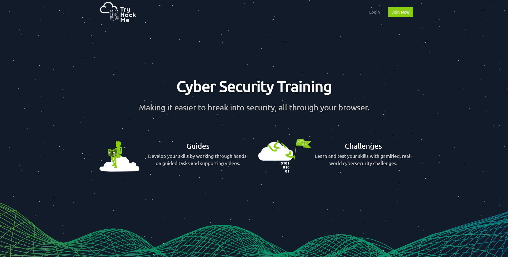

# Proyecto 1 Web
Este proyecto consiste en escoger una página ya existente y copiar el diseño. Para este caso se escogio la página
[TryHackMe](https://tryhackme.com/)


## Para ejecutar el programa
Los comandos para poder ejecutar el programa son los siguientes (Nota: es importante tener instalado NodeJs para utilizar los siguientes comandos):
Instalar todos las dependencias 
```
npm install
```
Construir la carpeta "dist", la cual se genera gracias a WebPack. En dicha carpeta se encontrará un archivo index.html el cual abrira el proyecto
```
npm run build
```
Este comando permite ejecutar el programa en la dirección ip: 127.0.0.0:8080 o en localhost:8080. Copia cualquiera de las dos direcciones en tu navegador y se abrirá el programa
```
npm run start
```

## Tecnologías usadas 
[](https://github.com/webpack/webpack)
[](https://github.com/facebook/react)
[](https://github.com/sass/sass)
[](https://github.com/eslint/eslint)
[](https://github.com/babel/babel)
[](https://github.com/akiran/react-slick)

## Proyecto realizado por

Orlando Osberto Cabrera Mejía #19943

Fecha de inicio: 8 de abril del 2021

Fecha de finalización: 18 de abril del 2021